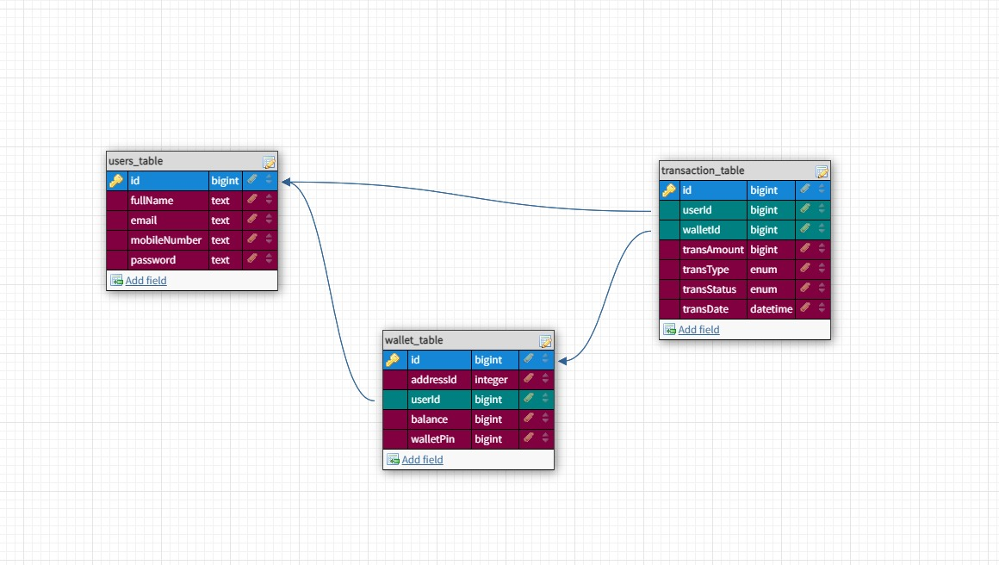

# Lendsqr Backend Engineer Task

Welcome to the Lendsqr Backend Task repository! This repository contains my codebase for the backend task of the Lendsqr Backend Engineer assessment project.
In this README, you'll find an overview of the project and how to set it up.

## Overview

The Lendsqr Backend Engineer Assessment is a part of the test to join the Lendsqr team,

# Demo Credit Wallet Service

Welcome to the Demo Credit Wallet Service! This project serves as an MVP (Minimum Viable Product) for a wallet functionality within a mobile lending app. In this service, users can create an account, fund their account, transfer funds to other users, and withdraw funds. Additionally, it includes a blacklist feature to prevent onboarding users with records in the Lendsqr Adjutor Karma blacklist.

## Features

- **User Account Creation**: Users can create an account to access wallet functionality.
- **Account Funding**: Users can fund their wallet accounts using various payment methods.
- **Fund Transfer**: Users can transfer funds from their wallet to another user's wallet.
- **Withdrawal**: Users can withdraw funds from their wallet to their linked bank accounts or other withdrawal methods.
- **Blacklist Integration**: Integration with the Lendsqr Adjutor Karma blacklist ensures that users with records in the blacklist are not onboarded.

## Tech Stack

- **Node.js**: Utilized as the runtime environment for server-side JavaScript code.
- **Knex.js ORM**: Used for database query building and interaction with the MySQL database.
- **MySQL Database**: A relational database management system used for storing user account information and transaction records.
- **TypeScript**: Provides static typing capabilities, enhancing code readability and maintainability.

## Setup Instructions

To set up the wallet service locally, follow these steps:

1. Clone the repository to your local machine:
   ```
   git clone https://github.com/IOS-Codex/lendsqr-backend-task.git
   ```

2. Navigate to the project directory:
   ```
   cd lendsqr-backend-task
   ```

3. Install dependencies:
   ```
   npm install
   ```

4. Set up environment variables:
   - Create a `.env` file in the root directory.
   - Define the following variables:
     ```
     PORT=9000
     DEV_DATABASE_HOST=your_mysql_test_database_host
     DEV_DATABASE_NAME=your_mysql_test_database_name
     DEV_DATABASE_USER=your_mysql_test_database_user
     DEV_DATABASE_PASSWORD=your_mysql_test_database_password
     
     PROD_DATABASE_STRING=your_mysql_database_host
     
     JWT_SECRET=your_jwt_secret_key
     
     ADJUTOR_BASE_URL='https://adjutor.lendsqr.com/v2'
     ADJUTOR_API_KEY=your_adjutor_api_key
     
     ```

5. Set up the MySQL database:
   - Create a MySQL database.
   - Update the `DATABASE_DETAILS` in the `.env` file with your MySQL connection string.

6. Run database migrations:
   ```
   npm run knex migrate:latest
   ```
   
 7. Postman Collection
    You can explore and test the API endpoints using the Postman collection available [here](https://www.postman.com/solar-equinox-704305/workspace/lendsqr-backend-test/collection/24223563-9da02198-2e76-47b0-9787-9624da0a8205?action=share&creator=24223563).


8. E-R Diagram (Database)
   

9. Start the server:
   ```
   npm start
   ```

10. The server should now be running locally. You can access the wallet service APIs at `http://localhost:9000`.


## Contact

If you have any questions or need assistance with the project, feel free to contact the project maintainers:

- **Maintainer**: [Oluwayomi Ilesanmi](mailto:yomilinus123@gmail.com)
